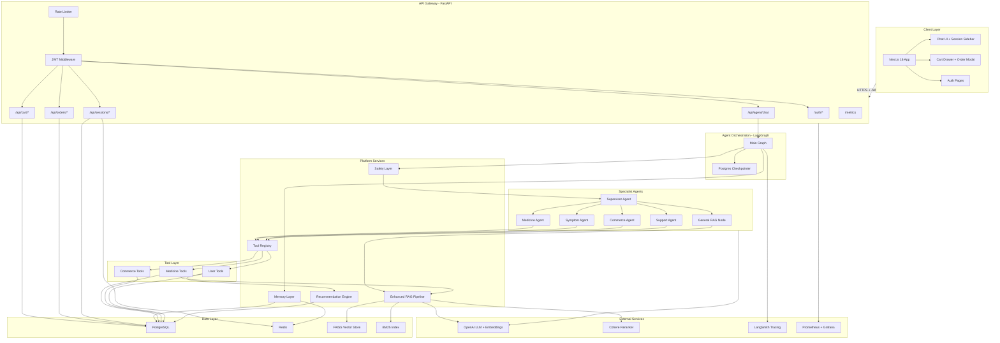
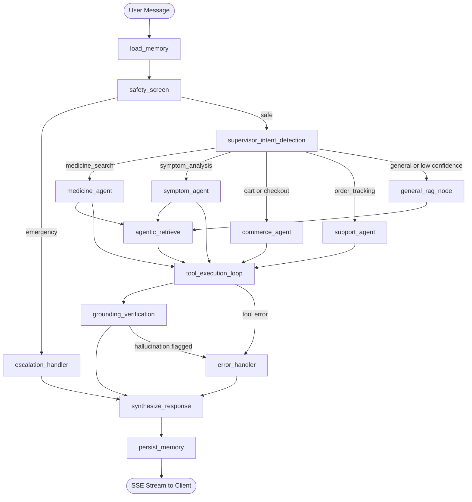
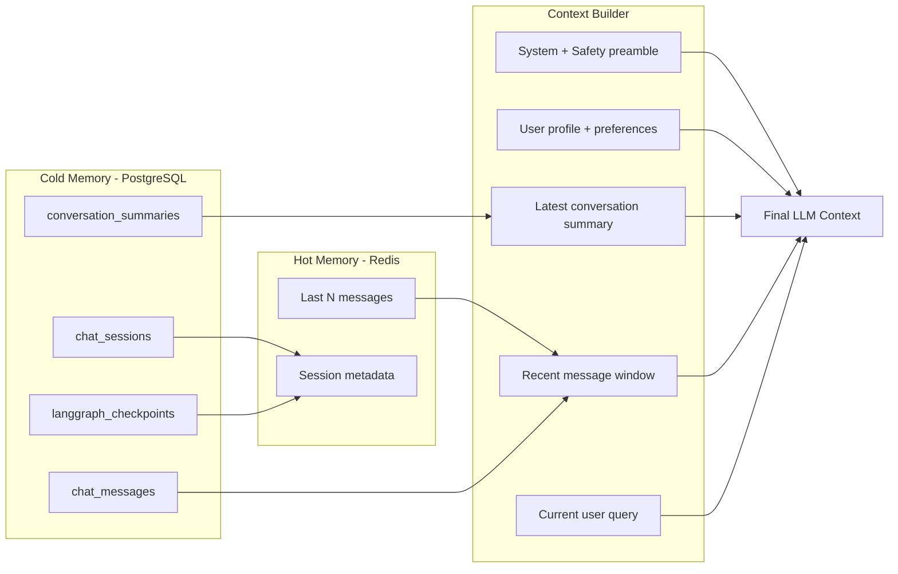
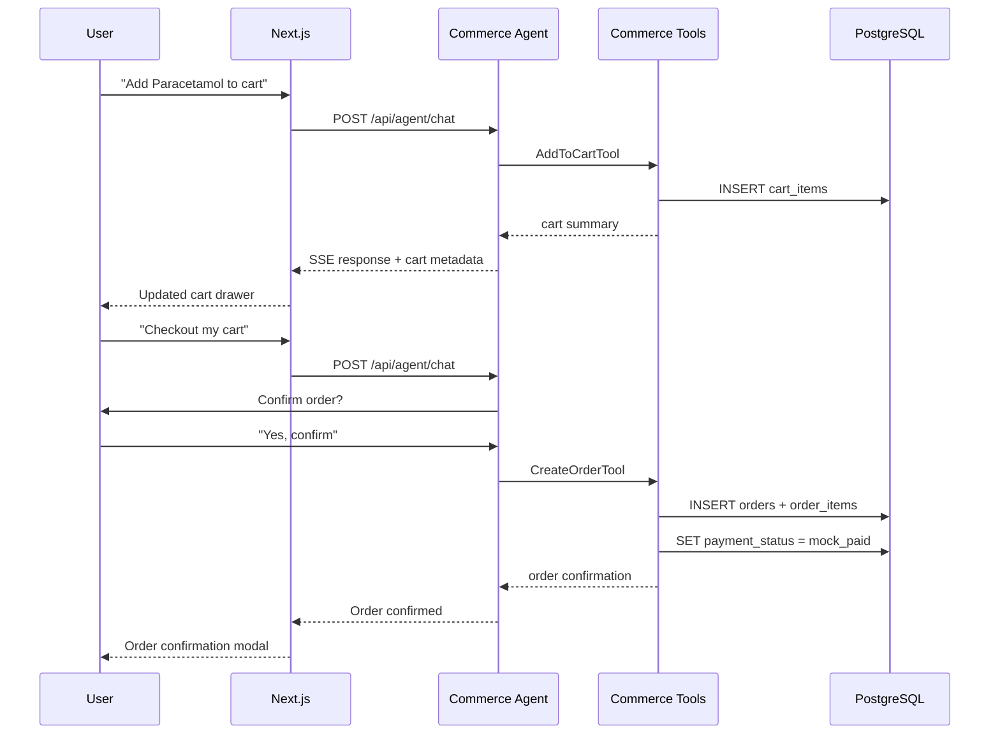
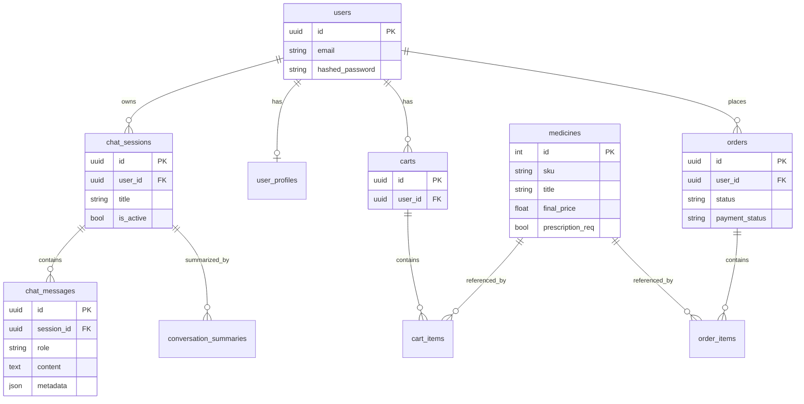
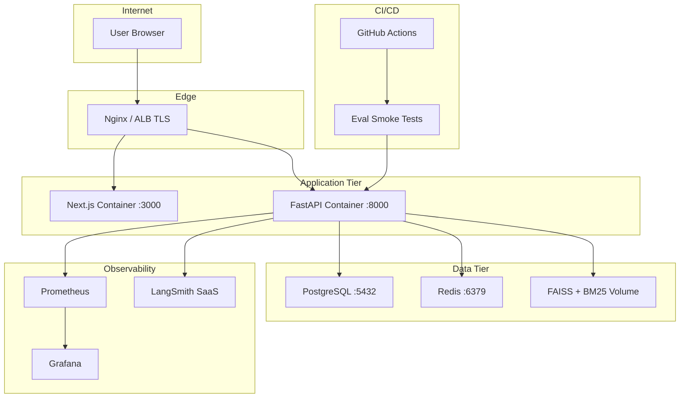

# Pharma Guide AI — Agentic Roadmap Plan

## Phased Delivery Workflow

**Rule: one phase at a time.** We implement only the current phase, run its acceptance checklist, then **stop and wait for your confirmation** before starting the next phase.

```mermaid
flowchart LR
    P0["Phase 0\nFoundation"] --> G0{Confirm?}
    G0 -->|yes| P1["Phase 1\nMemory"]
    P1 --> G1{Confirm?}
    G1 -->|yes| P2["Phase 2\nTools"]
    P2 --> G2{Confirm?}
    G2 -->|yes| P3["Phase 3\nLangGraph"]
    P3 --> G3{Confirm?}
    G3 -->|yes| P4["Phase 4\nSupervisor"]
    P4 --> G4{Confirm?}
    G4 -->|yes| P5["Phase 5\nAgents"]
    P5 --> G5{Confirm?}
    G5 -->|yes| P6["Phase 6\nAgentic RAG"]
    P6 --> G6{Confirm?}
    G6 -->|yes| P7["Phase 7\nCommerce"]
    P7 --> G7{Confirm?}
    G7 -->|yes| P8["Phase 8\nSafety"]
    P8 --> G8{Confirm?}
    G8 -->|yes| P85["Phase 8.5\nHITL Checkout"]
    P85 --> G85{Confirm?}
    G85 -->|yes| P9["Phase 9\nEval"]
    P9 --> G9{Confirm?}
    G9 -->|yes| P10["Phase 10\nObservability"]
    P10 --> G10{Confirm?}
    G10 -->|yes| P11["Phase 11\nPersonalization"]
    P11 --> G11{Confirm?}
    G11 -->|yes| P12["Phase 12\nSecurity"]
```



### How each phase ends

1. **Implement** — code changes scoped strictly to the current phase
2. **Verify** — run the phase acceptance checklist below (manual + automated where applicable)
3. **Demo** — brief walkthrough of what works
4. **Confirm** — you reply e.g. *"Phase 1 confirmed, proceed to Phase 2"*
5. **Next** — only then does work begin on the following phase

### 13 Phase Todos (gated)

| # | Phase | Scope | Acceptance criteria (confirm before next) |
|---|-------|-------|----------------------------------------|
| **0** | Foundation | Alembic, Redis, config, auth wiring, frontend auth fixes | Migrations run; Redis up in compose; JWT enforced on chat; login/register works end-to-end |
| **1** | Chat Memory | Sessions DB, Redis cache, summarization, session APIs, sidebar | Multi-turn chat persists across refresh; summaries created when threshold hit; session list loads |
| **2** | Tool Layer | 12 tools + registry + commerce DB tables | Each tool callable in isolation with valid/invalid input tests; cart CRUD via tools works |
| **3** | LangGraph | GraphState, checkpoints, skeleton graph, agent API | `POST /api/agent/chat` streams response; state persists across turns in same session |
| **4** | Supervisor | Intent detection + routing | 6 intents route correctly on test prompts; low-confidence falls back to general RAG |
| **5** | Specialist Agents | 4 agent subgraphs | Medicine/symptom/commerce/support queries handled by correct agent with tools |
| **6** | Agentic RAG | Rewrite, expand, filter, dedup, grounding | Retrieval quality improves on gold subset; answers include citations; hallucination flag works |
| **7** | Commerce | REST cart/order APIs + frontend cart UI | Add/view/update cart via UI; mock checkout creates confirmed order |
| **8** | Safety | Risk detector, guardrails, escalation | Emergency prompts trigger escalation; Rx restrictions enforced; commerce blocked on emergency |
| **9** | Evaluation | Gold datasets + RAGAS/DeepEval + CI | `make eval` passes smoke thresholds; CI job runs on PR |
| **10** | Observability | LangSmith + Prometheus + Grafana | Traces visible in LangSmith; `/metrics` exposes latency/token counters; Grafana dashboard loads |
| **11** | Personalization | User profiles + recommendations | Repeat-purchase and similar-product suggestions appear in agent context |
| **12** | Security | Rate limits, audit logs, data deletion | Rate limit returns 429; audit events logged; user data deletion cascades correctly |

### Current status

| Phase | Status |
|-------|--------|
| Phase 0 — Foundation | **NEXT** (not started) |
| Phases 1–12 | Blocked until prior phase confirmed |

**To begin:** say *"Start Phase 0"* or *"Implement Phase 0"*.  
**To advance:** say *"Phase N confirmed, proceed to Phase N+1"*.

---

## Current State (Baseline)

You have a working **single-turn RAG pipeline** and **Next.js chat UI**, but no agent layer, memory, or commerce transactions.

| Layer | Exists today | Key files |
|-------|--------------|-----------|
| Chat API | Stateless `POST /api/chat/ask` + stream | [`app/api/routes/chat.py`](app/api/routes/chat.py), [`app/services/rag_service.py`](app/services/rag_service.py) |
| Retrieval | Hybrid FAISS + BM25 → Cohere rerank → compression | [`app/retrieval/hybrid_search.py`](app/retrieval/hybrid_search.py) |
| Catalog DB | `Medicine` model + seed script (not wired to chat) | [`app/models/medicine.py`](app/models/medicine.py) |
| Auth | JWT + `users` table (not enforced on chat) | [`app/api/routes/auth.py`](app/api/routes/auth.py) |
| Frontend | Zustand in-memory messages, product cards (read-only) | [`frontend/src/store/chatStore.ts`](frontend/src/store/chatStore.ts) |

## Final Architecture

The target system is a **layered, multi-agent platform**: Next.js client → FastAPI gateway → LangGraph orchestration → specialist agents → tool layer → hybrid RAG + PostgreSQL/Redis stores, wrapped by safety, observability, and evaluation.

### 1. System Overview



### 2. LangGraph Agent Workflow



### 3. Memory & Context Assembly



### 4. Enhanced RAG Pipeline

```mermaid
flowchart LR
    Query["User Query + History"] --> Rewrite["Query Rewriter"]
    Rewrite --> Expand["Query Expansion"]
    Expand --> MultiQ["Multi-Query Generator"]
    MultiQ --> Hybrid["Hybrid Search"]
    Hybrid --> Vector["FAISS Vector"]
    Hybrid --> Keyword["BM25"]
    Vector --> RRF["RRF Fusion"]
    Keyword --> RRF
    RRF --> MetaFilter["Metadata Filters"]
    MetaFilter --> Rerank["Cohere Rerank"]
    Rerank --> Dedup["SKU Dedup"]
    Dedup --> Compress["Context Compression"]
    Compress --> Verify["Retrieval Validation"]
    Verify --> AgentCtx["Agent Context + Citations"]
```



### 5. Commerce Flow (Mock Payments)



### 6. Data Model (Core Entities)



### 7. Production Deployment



### Layer Responsibilities

| Layer | Responsibility | Key modules |
|-------|----------------|-------------|
| Client | Chat, sessions, cart, auth UX | `frontend/src/components/chat/`, `cartStore.ts` |
| API Gateway | Auth, rate limits, REST + SSE | `app/api/routes/`, `app/core/security.py` |
| Orchestration | Intent routing, state, checkpoints | `app/agents/graph.py`, `app/agents/supervisor.py` |
| Specialist Agents | Domain reasoning + tool use | `app/agents/medicine_agent.py`, etc. |
| Tool Layer | Structured DB + RAG actions | `app/tools/` |
| Memory | Hot/cold history + summarization | `app/memory/` |
| Safety | Risk detection, guardrails, escalation | `app/safety/` |
| RAG | Retrieval, rerank, grounding | `app/retrieval/`, `app/agents/nodes/retrieve.py` |
| Data | Persistence + indexes | PostgreSQL, Redis, `data/vector_store/` |
| Observability | Traces, metrics, dashboards | `app/observability/`, LangSmith, Grafana |
| Evaluation | Quality gates in CI | `app/evaluation/`, `data/evaluation/` |

---

## Phase 0: Foundation (Prerequisites)

**Gate:** Complete and confirm Phase 0 before any Phase 1 work begins.

These unblock Phases 1–12:

1. **Alembic migrations** — scaffold exists but no `alembic/versions/`; replace `create_all()` with versioned migrations for all new tables.
2. **Auth on chat** — apply `get_current_user` from [`app/core/security.py`](app/core/security.py) to chat/agent routes; associate sessions with `user_id`.
3. **Config expansion** — extend [`app/core/config.py`](app/core/config.py) with `REDIS_URL`, `LANGSMITH_API_KEY`, `LANGSMITH_PROJECT`, token budgets, rate-limit settings.
4. **Docker** — add Redis service to [`docker-compose.yml`](docker-compose.yml); remove or fix broken Streamlit service (no `streamlit_app.py`).
5. **Frontend auth fixes** — align register/login response shapes, fix `/auth` route, wire `session_id` through chat API calls.
6. **Target backend layout** (new modules):

```
app/
├── agents/           # LangGraph graphs + nodes
├── tools/            # Medicine, commerce, user tools
├── memory/           # Redis + DB memory services
├── safety/           # Guardrails + escalation
├── evaluation/       # RAGAS / DeepEval runners
└── observability/    # LangSmith, metrics middleware
```

---

## Phase 1: Chat Memory & Conversation Management

### Database design (PostgreSQL)

Add SQLAlchemy models + Alembic migrations:

| Table | Purpose | Key columns |
|-------|---------|-------------|
| `chat_sessions` | Conversation thread | `id` (UUID), `user_id` FK, `title`, `created_at`, `updated_at`, `is_active` |
| `chat_messages` | Message log | `id`, `session_id` FK, `role` (user/assistant/system/tool), `content`, `metadata` (JSON: products, tool_calls), `token_count`, `created_at` |
| `conversation_summaries` | Long-term memory | `id`, `session_id` FK, `summary_text`, `covers_message_ids` (JSON range), `token_count`, `created_at` |

Files: `app/models/chat_session.py`, `app/models/chat_message.py`, `app/models/conversation_summary.py`

### Memory layer

| Component | Implementation |
|-----------|----------------|
| Redis session cache | `app/memory/redis_client.py` — hot window of last N messages keyed `session:{id}:messages` |
| History retrieval | `app/memory/history_service.py` — read Redis → fallback Postgres |
| Summarization | `app/memory/summarization_service.py` — trigger when message tokens exceed threshold (e.g. 6K) |
| Context window mgmt | `app/memory/context_builder.py` — assemble: system + latest summary + last K messages + current query |
| Pruning | Archive messages older than summary; cap Redis list length; TTL on inactive sessions |

**Pruning strategy:** Keep last 10 messages in Redis; when total session tokens > `SUMMARY_THRESHOLD`, summarize oldest block into `conversation_summaries`, prune Redis to recent window.

### API changes

Extend [`app/models/request_model.py`](app/models/request_model.py):

```python
class QueryRequest(BaseModel):
    query: str
    session_id: str | None = None  # create if missing
```

New routes in `app/api/routes/sessions.py`:
- `POST /api/sessions` — create session
- `GET /api/sessions` — list user sessions
- `GET /api/sessions/{id}/messages` — paginated history
- `DELETE /api/sessions/{id}` — soft delete

Update [`app/services/rag_service.py`](app/services/rag_service.py) (interim) to accept `messages` + `summary` in prompt before LangGraph replaces it.

### Frontend

- Add `sessionId` to [`frontend/src/store/chatStore.ts`](frontend/src/store/chatStore.ts)
- Session sidebar in `ChatInterface` (new chat, resume thread)
- Persist `activeSessionId` in localStorage; load history on mount

---

## Phase 2: Tool Layer

Create a shared tool base in `app/tools/base.py`:
- Pydantic input/output schemas
- `@tool` wrappers with validation, structured errors, retry (tenacity, max 2 retries), loguru logging
- Tool registry: `app/tools/registry.py`

### Medicine tools (query `medicines` table + RAG)

| Tool | Backend | Data source |
|------|---------|-------------|
| `SearchMedicineTool` | SQL + hybrid search | `Medicine` + [`HybridRetriever`](app/retrieval/hybrid_search.py) |
| `AlternativeMedicineTool` | composition/salt match | `Medicine.composition_key`, `salt_type` |
| `StockAvailabilityTool` | `is_active` + optional inventory field | Add `stock_quantity` column if needed |
| `ProductDetailsTool` | SKU lookup | `Medicine` by `sku` |

### Commerce tools (mock payments per your choice)

| Tool | Maps to |
|------|---------|
| `AddToCartTool` | `cart_items` table |
| `RemoveFromCartTool` | cart CRUD |
| `UpdateCartTool` | quantity validation vs `min/max_order_quantity` |
| `ViewCartTool` | join cart + medicine |
| `CreateOrderTool` | create `orders` + `order_items`, status `pending_payment` → auto `confirmed` (mock) |
| `OrderStatusTool` | `orders.status`, tracking fields |

New tables: `carts`, `cart_items`, `orders`, `order_items`

### User tools

| Tool | Source |
|------|--------|
| `UserProfileTool` | extend `users` or `user_profiles` |
| `PurchaseHistoryTool` | `orders` by `user_id` |

Wire tools to LangChain `StructuredTool` with JSON schema exported for agent binding.

---

## Phase 3: LangGraph Foundation

### Dependencies

Add to [`requirements.txt`](requirements.txt) / [`pyproject.toml`](pyproject.toml):
- `langgraph`
- `langgraph-checkpoint-postgres` (or `langgraph-checkpoint-sqlite` for dev)
- `tenacity` (tool retries)

### Graph state (`app/agents/state.py`)

```python
class GraphState(TypedDict):
    user_id: str
    session_id: str
    messages: Annotated[list, add_messages]
    intent: str | None
    intent_confidence: float
    retrieved_docs: list
    tool_outputs: list
    memory_summary: str | None
    safety_flags: list[str]
    final_response: dict | None
```

### Persistence

- **Checkpoints:** Postgres via `AsyncPostgresSaver` — table `checkpoints` managed by LangGraph
- **Thread ID:** map `session_id` → LangGraph `thread_id`

### Graph skeleton (`app/agents/graph.py`)

Nodes: `load_memory` → `safety_screen` → `supervisor` → (specialist agents) → `synthesize_response` → `persist_memory`

Error transitions: any node failure → `error_handler` node → safe user message + log

Entry point: new `app/api/routes/agent.py` replacing/augmenting chat routes with `POST /api/agent/chat` (stream via LangGraph `astream_events`).

---

## Phase 4: Supervisor Agent

`app/agents/supervisor.py` — LLM classifier with structured output:

```python
class IntentResult(BaseModel):
    intents: list[Literal["medicine_search", "symptom_analysis", "cart", "checkout", "order_tracking", "general"]]
    confidence: float
    primary_intent: str
```

**Routing map:**

| Intent | Route to |
|--------|----------|
| medicine_search | Medicine Agent |
| symptom_analysis | Symptom Agent (+ safety pre-check) |
| cart / checkout | Commerce Agent |
| order_tracking | Support Agent |
| general | Lightweight RAG node (reuse existing pipeline) |

**Multi-intent:** sequential execution (e.g. symptom → medicine suggestions → add to cart) via supervisor re-entry.

**Fallback:** confidence < 0.6 → general RAG + clarifying question.

**Monitoring:** log `intent`, `confidence`, `routed_agent` to LangSmith + Prometheus counters in `app/observability/metrics.py`.

---

## Phase 5: Specialized Agents

Each agent = LangGraph subgraph with bound tools + domain system prompt.

### Medicine Agent (`app/agents/medicine_agent.py`)
- Handles dosage, side effects, usage, alternatives
- Tools: `SearchMedicineTool`, `AlternativeMedicineTool`, `ProductDetailsTool`
- Reuses enhanced RAG for unstructured policy/PDF context

### Symptom Agent (`app/agents/symptom_agent.py`)
- Symptom → medicine mapping with **safety disclaimers**
- Tools: `SearchMedicineTool`, `ProductDetailsTool`
- Never diagnoses; always "consult a doctor" for ambiguous cases

### Commerce Agent (`app/agents/commerce_agent.py`)
- Cart ops + checkout confirmation workflow
- Tools: all cart/order tools
- **Confirmation gate:** `CreateOrderTool` only after explicit user confirmation stored in state

### Support Agent (`app/agents/support_agent.py`)
- Order tracking, delivery FAQ from RAG policy docs
- Tools: `OrderStatusTool`, `PurchaseHistoryTool`

---

## Phase 6: Agentic RAG Enhancements

Extend existing retrieval modules rather than replacing them:

| Enhancement | File | Change |
|-------------|------|--------|
| Query rewriting | `app/retrieval/query_rewriter.py` | LLM rewrite using chat history |
| Query expansion | [`app/retrieval/query_expansion.py`](app/retrieval/query_expansion.py) | Increase `limit` from 1; agent-controlled |
| Multi-query | `app/retrieval/multi_query.py` | Generate 3 variants, fuse with RRF |
| Metadata filtering | `app/retrieval/filters.py` | Filter by `prescription_req`, `dosage_form`, `subcategory_id` |
| Reranking | [`app/retrieval/reranker.py`](app/retrieval/reranker.py) | Already exists — expose `top_k` per agent |
| Context compression | [`app/retrieval/compression.py`](app/retrieval/compression.py) | Dynamic threshold by token budget |
| Dedup | `app/retrieval/dedup.py` | SKU-level dedup post-retrieval |
| Grounding | `app/retrieval/verification.py` | Citation extraction; faithfulness check node |
| Hallucination check | `app/safety/grounding_check.py` | Compare answer claims vs retrieved chunks |

Integrate as `app/agents/nodes/retrieve.py` callable from Medicine/Symptom/General nodes.

---

## Phase 7: Cart & Ordering Integration (Mock Payments)

### REST APIs (`app/api/routes/`)

| Endpoint | Purpose |
|----------|---------|
| `POST /api/cart/items` | Add item |
| `PATCH /api/cart/items/{sku}` | Update qty |
| `DELETE /api/cart/items/{sku}` | Remove |
| `GET /api/cart` | View cart |
| `POST /api/orders` | Create order (mock: auto-confirm) |
| `GET /api/orders` | Order history |
| `GET /api/orders/{id}` | Status + items |

**Mock payment flow:** `CreateOrderTool` sets status `confirmed` immediately with `payment_status: mock_paid`; no external gateway.

### AI integration

- Commerce Agent calls tools; returns structured `cart_summary` / `order_confirmation` in response metadata
- Frontend: "Add to cart" on product cards → calls REST or triggers agent ("add SKU-123 to cart")

### Frontend commerce UI

- `frontend/src/store/cartStore.ts`
- Cart drawer component
- Order confirmation modal
- Extend [`MessageList.tsx`](frontend/src/components/chat/MessageList.tsx) product cards with actions

---

## Phase 8: Medical Safety Layer

`app/safety/` module integrated as **first graph node** and **per-agent guardrails**.

### Risk detection (`app/safety/risk_detector.py`)

Rule + LLM hybrid for:
- Emergency symptoms (chest pain, difficulty breathing, etc.)
- Severe adverse reactions
- Pregnancy / pediatric keywords
- Prescription-only drug requests

Leverage `Medicine.prescription_req` and `scheduled_drug` in tool responses.

### AI guardrails (`app/safety/guardrails.py`)

- Prompt injection patterns in user input
- Block treatment/diagnosis advice outside informational scope
- Restrict Rx medicine purchase without prescription flag (soft block + escalation message)

### Escalation (`app/safety/escalation.py`)

Return structured `SafetyResponse` with `level: info | warning | emergency` and canned messages:
- Emergency → "Seek immediate medical attention" + disable commerce tools
- Doctor consult → append to all Symptom Agent responses

Update [`app/core/prompts.py`](app/core/prompts.py) with safety preamble injected into all agent prompts.

---

## Phase 8.5: Human-in-the-Loop Order Confirmation

Insert a mandatory review-and-confirm checkpoint before creating orders in both
REST checkout and agent-driven checkout.

### Backend checkout confirmation flow

- New `checkout_confirmations` table stores snapshot, status, expiry, and
  cart hash used for stale-cart detection.
- `POST /api/orders/prepare` creates a `confirmation_id` and returns reviewed
  items + total + expiry.
- `POST /api/orders` requires `confirmation_id` and only places order when:
  pending token exists, not expired, and cart hash has not changed.
- Optional `DELETE /api/orders/prepare/{confirmation_id}` cancels review token.

### Commerce agent flow

- Replace direct `create_order` tool call with:
  - `prepare_order` (generate review token + summary)
  - `confirm_order` (place order with `confirmation_id`)
- Prompt guardrail: never call `confirm_order` until explicit user confirmation.

### Frontend UX

- Cart drawer checkout is now two-step:
  - Step 1: Proceed to review
  - Step 2: Confirm & place order / Back / Cancel review
- Chat assistant can return `orderConfirmation` payload; UI renders an inline
  confirmation card with Confirm/Cancel actions.

---

## Phase 9: Evaluation Framework

`app/evaluation/` + `tests/evaluation/` + GitHub Actions workflow.

### Gold dataset

- `data/evaluation/gold_retrieval.jsonl` — query, relevant SKUs, category
- `data/evaluation/gold_rag.jsonl` — query, expected answer themes, required citations
- `data/evaluation/gold_agent.jsonl` — query, expected intent, expected tools

### Metrics

| Category | Metrics | Tool |
|----------|---------|------|
| Retrieval | Recall@K, Precision@K, Hit Rate | Custom + RAGAS |
| RAG | Faithfulness, Context Precision/Recall, Answer Relevancy | RAGAS |
| Agent | Tool selection accuracy, routing accuracy, task completion | DeepEval + custom assertions |

### Automation

- `make eval` → `python -m app.evaluation.runner`
- CI job on PR: run subset (smoke eval, ~20 cases) with threshold gates
- Nightly full eval against complete gold set

---

## Phase 10: Observability

### LangSmith

- Set `LANGCHAIN_TRACING_V2=true` in env
- Trace: supervisor routing, agent nodes, tool calls, retrieval steps
- Wrap [`RAGService`](app/services/rag_service.py) and LangGraph with consistent `run_name` tags

### Metrics (`app/observability/metrics.py`)

Prometheus-compatible counters/histograms:
- `llm_tokens_total`, `llm_cost_usd` (estimate from token counts)
- `response_latency_seconds`, `retrieval_latency_seconds`, `tool_latency_seconds`
- `intent_routing_total{intent, agent}`

Expose `GET /metrics` via `prometheus-fastapi-instrumentator`.

### Dashboards

- Grafana docker service in compose
- Dashboards: latency percentiles, token cost, intent distribution, error rate
- Alerts: p95 latency > 10s, error rate > 5%, retrieval hit rate drop

---

## Phase 11: Personalization

Depends on Phase 1 memory + Phase 7 orders.

### User memory (`app/memory/user_memory.py`)

Store in `user_profiles` JSON or dedicated table:
- Preferred brands (`brand_tags`)
- Frequently purchased SKUs (aggregated from `order_items`)
- Recent searches

### Recommendation engine (`app/services/recommendation_service.py`)

- Similar products: composition_key / salt_type match
- Repeat purchase: last 90-day orders
- Seasonal: tag-based rules (optional, rule engine first)

Inject into Commerce/Medicine agent context via `UserProfileTool` + recommendation snippet in system prompt.

---

## Phase 12: Security & Compliance

| Area | Implementation |
|------|----------------|
| Rate limiting | `slowapi` on `/api/agent/chat`, auth routes |
| Secret management | `.env` dev; document AWS Secrets Manager / Doppler for prod |
| API security | JWT on all mutating routes; CORS lock to `CLIENT_URL` |
| Audit logs | `audit_events` table: user_id, action, resource, timestamp |
| Encryption in transit | TLS termination at reverse proxy (nginx/ALB) |
| Encryption at rest | Postgres + Redis managed service defaults |
| Data deletion | `DELETE /api/user/data` — cascade sessions, messages, cart, anonymize orders |

---

## Phase Groupings (for planning only — still delivered one phase at a time)

Phases are **never implemented in parallel batches**. Groupings below are for rough effort sizing only.

| Group | Phases | Rough effort | Cumulative outcome |
|-------|--------|--------------|-------------------|
| Foundation | 0 → 1 | ~2 weeks | Auth + multi-turn memory working |
| Agent core | 2 → 3 → 4 → 5 | ~4 weeks | LangGraph with 4 specialist agents |
| Enhancement | 6 → 7 → 8 | ~3 weeks | Better RAG, commerce UI, safety |
| Production | 9 → 10 → 11 → 12 | ~4 weeks | Eval, observability, personalization, security |

**After each phase:** stop, verify acceptance criteria, get your confirmation, then continue.

---

## Key Integration Points with Existing Code

- **Keep `HybridRetriever`** as the retrieval engine inside agent nodes — do not rewrite
- **Migrate `RAGService.ask`** logic into `app/agents/nodes/general_rag.py`; deprecate direct chat route once agent route is stable
- **Reuse `ChatResponse`** Pydantic model for structured product suggestions in agent final node
- **Wire `Medicine` DB** into tools so product cards reflect live prices/stock, not just retrieved chunks
- **Extend `QueryRequest`** rather than adding parallel request shapes

---

## Risk & Scope Notes

- **Symptom Agent liability:** keep informational-only posture; safety layer is mandatory before enabling symptom routing
- **LangGraph streaming:** structured output + streaming requires `astream_events` parsing on frontend — update [`chatService.ts`](frontend/src/services/chatService.ts) accordingly
- **Checkpoint storage:** Postgres checkpoints grow fast — add retention job for completed sessions
- **Eval cost:** run smoke eval on PR, full eval nightly to control OpenAI spend
